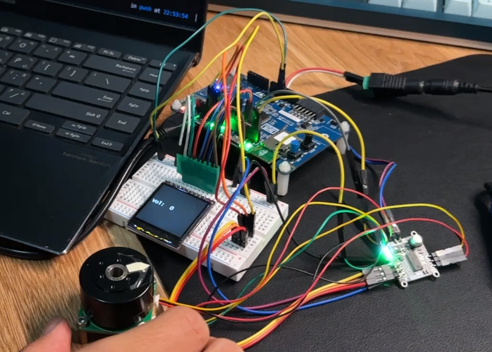

# Embedded System Final Project (Group 8)
# Computer Knob with FOC Controlled Gimbal Motor
### 林萬荃 周君桓 陳柏睿
We utilize STM B-L475E-IOT01A as our main MCU.  For controlling the knob, which is a gimbal motor, the rotary encoder on the the motor will read the position of the motor, and send the data to the STM board using I2C. The STM board will then process the data and send three-phase control signal to control the motor. As for connecting with user application(i.e. computer), we can use two methods, one is using USB HID(Human Interface Device) for wired connection, and the other is using BLE(Bluetooth Low Energy) for wireless communication. Additionally, we also have a LCD display to show what we are controlling currently. The STM board draws the pixels on the LCD display through SPI.

## Project structure 
Apart from the generated files from STM32CubeMX, we have some custom modules: FOC, ST7789, USB_media.
The project structure is configured by CMakeLists.txt.

```bash
.
├── BLE
├── cmake
├── CMakeLists.txt
├── CMakePresets.json
├── Core
├── Drivers
├── Final_Report.pdf
├── FOC
├── image
├── Middlewares
├── README.md
├── ST7789
├── st7789_test.ioc
├── startup_stm32l475xx.s
├── STM32L475VGTx_FLASH.ld
├── USB_DEVICE
└── USB_media
```

## How to use
Clone the repository

```bash
git clone git@github.com:rakechen-0307/Embedded-System.git
```

Change the directory to the build directory

```bash
cd final; mkdir build; cd build
```
Compile the code

```bash
build$ cmake ..
build$ cmake --build .
```
Flash the following .elf file to the board

```bash
Embedded-System/final/build/final.elf
```

<div align="center">
    
</div>