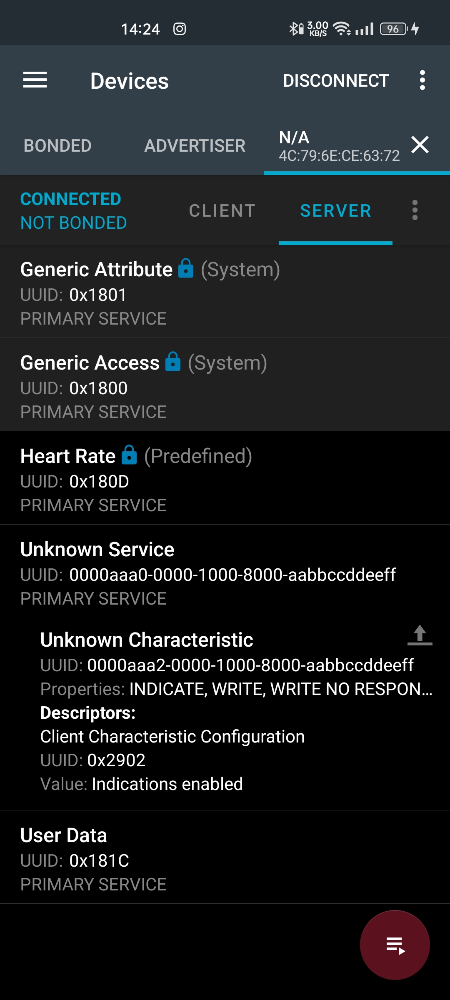
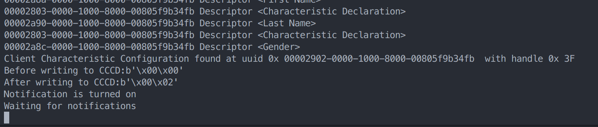
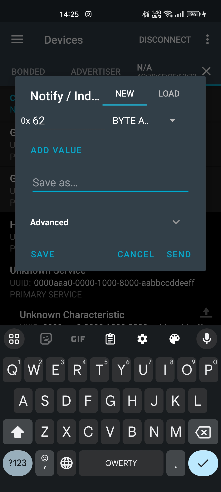
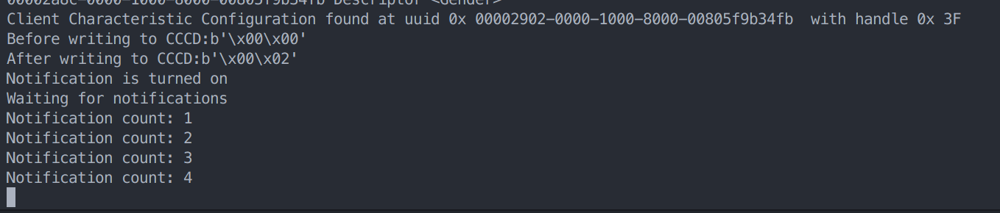

<head>
<link rel="stylesheet" type='text/css' href="https://cdn.jsdelivr.net/gh/devicons/devicon@latest/devicon.min.css" />
<head/>

# <i class="devicon-python-plain"></i> Embedded system HW3

- Team member: 林萬荃 周君桓 陳柏睿
- This is a `python` program with bluepy library in attemp to change the `CCCD` value of a test GATT service on android phone.
- The repository contains the following files:
  - README.md
  - main.py

## How to use & Expected behavior

From the <i class="devicon-android-plain colored"></i> android app you can see the service uuid and the characteristic uuid



Write them into the `main.py` line 4 and 5 together with the `complete_local_name` of the device at line 6

```python
test_service_uuid = "0000aaa0-0000-1000-8000-aabbccddeeff"
test_service_char_uuid = "0000aaa2-0000-1000-8000-aabbccddeeff"
complete_local_name = "WanchuanPhone"
``````
and run the program with `sudo` privilege

```bash
sudo python3 main.py
```
You shoud see the following output, as you can see the `CCCD` value has been changed from `0x0000` to `0x0002` and the service is waiting for notification



Send a notification from the android app 



you should see the following output (sent random data 4 times)



## Courtesy

[beautifulzzzz](https://www.cnblogs.com/zjutlitao/p/10171913.html)

[bluepy manual](https://ianharvey.github.io/bluepy-doc/index.html)
