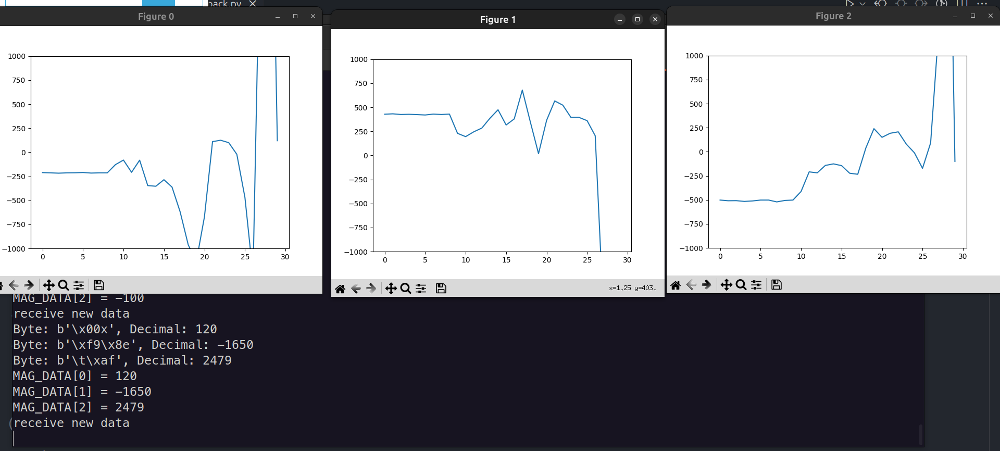

# 3D magnetometer GATT service 

## GATT server
### Run with Mbed CLI1
use `B-L475E-IOT01A` as GATT server. Follow the instruction in [mbed-os-example-ble](https://github.com/ARMmbed/mbed-os-example-ble/) using `mbed CLI1`

After mbed deploy, import BSP
```bash
mbed add http://os.mbed.com/teams/ST/code/BSP_B-L475E-IOT01/
```
And replace the /source directory with the one in this repository.
```bash
./Mbed_CLI
    ./source
        ├── MagService.h
        └── main.cpp
```
Then run the following command to compile and flash the GATT server
```bash
mbed compile -m DISCO_L475VG_IOT01A -t GCC_ARM --flash --sterm --baudrate 115200
```
### Run with Mbed Studio
The `./mbed-os-ble-mag` under the directory `./Mbed_Studio` can be built in Mbed Studio.
## Linux client plotting
Copy /python_plot to your Linux machine and run the following command to install the required packages
```bash
cd Python_central
python_plot$ sudo python3 ble_scan_connect.py
```
after the linux machine has connected to the GATT server, you shold see 3 figure plotting the magnetometer data in x, y, and z axis. and the terminal will print the magnetometer data.

### Screen shot
