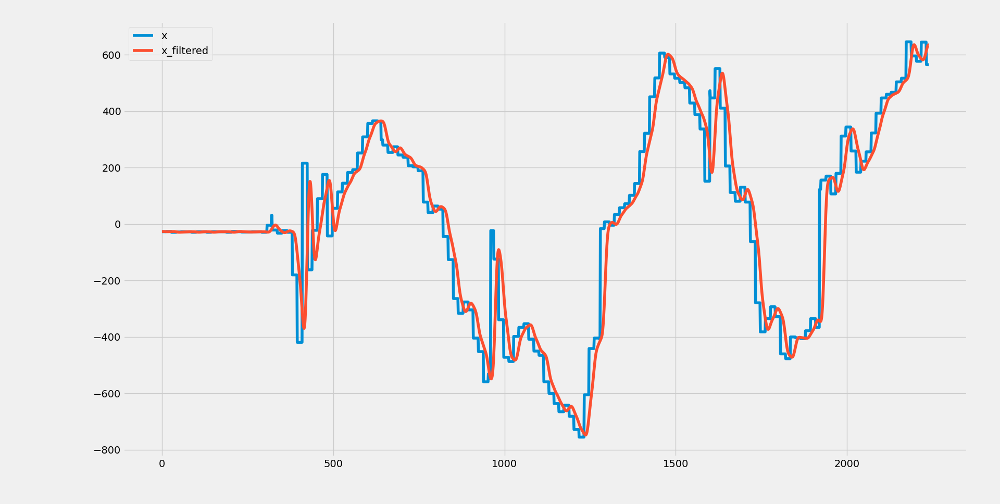
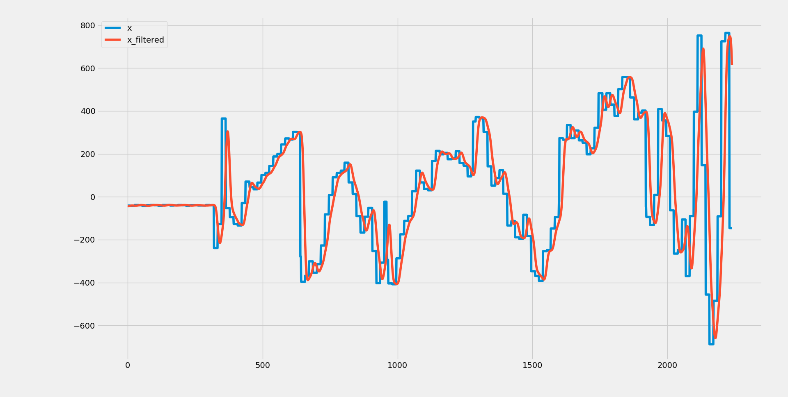

# Embedded System HW7 (Group 8)

This is the repository for the 7th homework of the Embedded System course. The goal of this homework is to implement a digital signal processing (DSP) algorithm on the STM32L4 board. The DSP algorithm is a simple low-pass filter that processes the `IMU x-axis` data and outputs the filtered and unfiltered data to the serial port `UART1` to see the effect.

## How to use
1. Clone the repository

```bash
git clone git@github.com:rakechen-0307/Embedded-System.git
```
### Pre-requisite:
```bash
pip install -r Embedded-System/hw7/python/requirements.txt
sudo apt install gcc-arm-none-eabi
```

2. Change the directory to the build directory

```bash
cd hw7; mkdir build; cd build
```
3. Compile the code

```bash
cmake ..
cmake --build .
```
4. Flash the following .elf file to the board

```bash
Embedded-System/hw7/build/DSP.elf
```
5. Receive the input data at the same time you can shake the board to see the effect of the low-pass filter
```
cd python
python3 ReadSerial.py
```
Notice that you may need to change the PORT number in line 24. 
6. Plot the input data
```
python3 plot.py
```

## Filter construction
```
cd python
python3 fir.py
```
fir.py construct a FIR filter, plot the frequency response and the filtering effect on a sine wave for verification.

## Verification
```
cd python
python3 verification.py
```
verification.py read the data.csv and filtered_output.csv generated by ReadSerial.py and fir.py and plot a plot to compare them.
## Result

